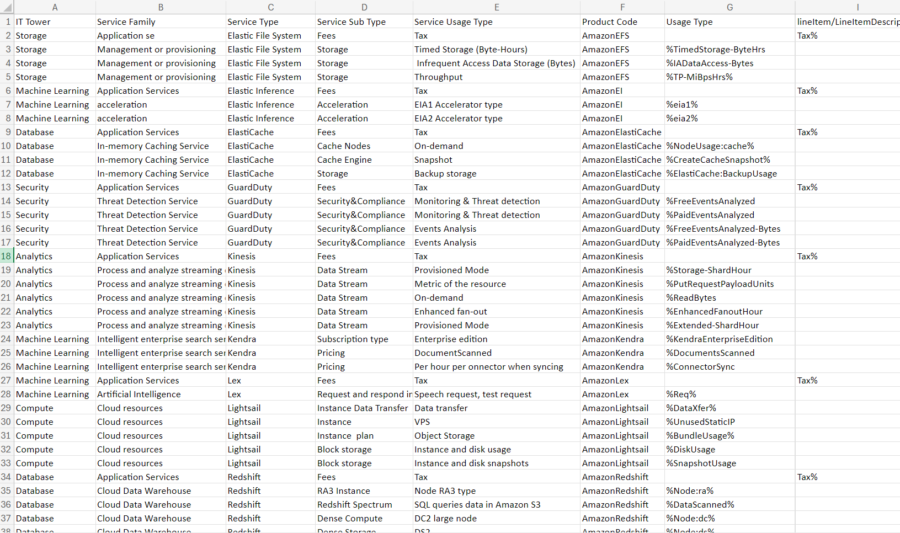

# Аналитическая работа (AWS)

Вариант №6

## Цель работы

Освоение облачных сервисов, углубленное изучение уровней абстракции инфраструктуры в облаке, формирование понимания различных моделей потребления сервисов и сравнение этих сервисов между разными провайдерами для более эффективной оценки возможности перехода на отечественные платформы.

Определить соответствие каждого сервиса международного провайдера русскому сервису. Заполнить информацию об отечественных сервисах, сопоставляя их напротив AWS/Azure

Сохранить табличку в .md файл и залить в соответствующую папку на Git. Еще раз, на Git должен лежать именно .md файл с таблицей

Дополнить отчет в .md файл на Git, описывающий ваши действия и размышления. Необходимо также кратко (1-2 абзаца) описать , какие сервисы были даны, за что они отвечают.

## Классификация сервисов 

### Мы имеем следующие столбцы

**IT Tower** - сервис ответственный за управление, обеспечение поддержки и анализ характеристик сервиса группа.

**Service Family** - кластер сервисов, предназначенных для выполнения конкретной задачи и интегрированных с конкретным приложением.

**Service Type** - Категория сервиса в рамках определенной группы.

**Service Sub Type** - Подтип сервиса.

**Service Usage Type** - Режим использования сервиса с учетом его конкретного подтипа, определяющий разновидности запросов, доступные пользователю при взаимодействии с данным сервисом.

## Описание сервисов и их отечественные аналоги

В таблице встретились несколько сервисов от AWS. Попробуем кратко описать каждый из них, а также постараемся найти отечественные аналоги на платформе Yandex Cloud.

### 1. Amazon Elastic File System
Это облачный сервис хранения файлов, разработанный компанией Amazon Web Services (AWS) для предоставления масштабируемого, эластичного и зашифрованного хранилища файлов, которое может быть использовано как с сервисами AWS, так и с локальными ресурсами.

EFS построен на базе технологии Network File System (NFS) версий 4.0 и 4.1 и поддерживает контроль доступа к файлам через POSIX разрешения.

Аналог: Yandex Object Storage - это масштабируемое облачное хранилище от Yandex Cloud, предназначенное для хранения файлов проектов (сайтов или приложений) как для публичного, так и для закрытого доступа. Оно поддерживает хранение файлов любого формата без обработки данных, сохраняя их в изначальном виде. Это решение подходит как для высоконагруженных проектов, требующих быстрого доступа к данным, так и для сайтов с минимальными требованиями к инфраструктуре хранения, например, для статических сайтов.

### 2. Amazon Elastic Inference
Это инновационная функция, предлагаемая Amazon Web Services (AWS), предназначенная для повышения производительности и экономической эффективности рабочих нагрузок машинного обучения. Она позволяет пользователям подключать ускорение логического вывода на базе GPU к инстансам Amazon Elastic Compute Cloud (EC2), значительно ускоряя работу глубоких нейронных сетей.

Аналог: Отсутствует, Однако, Yandex Cloud предоставляет различные сервисы машинного обучения,, где вы можете развертывать и обучать модели, хотя это не совсем то же самое, что Amazon Elastic Inference.

### 3. Amazon ElastiCache
Полностью управляемый сервис кэширования данных в памяти, предоставляемый Amazon Web Services (AWS). Он предназначен для улучшения производительности веб-приложений за счет извлечения информации из управляемых кэшей в памяти, вместо того чтобы полагаться исключительно на более медленные дисковые базы данных.

Аналог: Redis — это популярная распределённая система кэширования данных в оперативной памяти с открытым исходным кодом. Она поддерживает различные типы структур данных, такие как строки, хэши, списки, множества и отсортированные множества, и обеспечивает высокую производительность и масштабируемость.

### 4. Amazon GuardDuty
Сервис, предоставляемый Amazon Web Services (AWS), предназначенный для обнаружения угроз безопасности в аккаунтах AWS. Он работает путем непрерывного анализа и мониторинга необычных и неожиданных действий в вашей учетной записи AWS, рабочих нагрузках и данных, хранящихся в Amazon S3. GuardDuty анализирует миллиарды запросов из различных источников данных AWS, таких как журналы событий AWS CloudTrail, журналы потоков Amazon Virtual Private Cloud (VPC) и журналы системы доменных имен (DNS), чтобы выявить потенциальные угрозы.

Аналог: Yandex Smart Web Security — это новый сервис от компании Яндекс, предназначенный для защиты веб-приложений от DDoS-атак. Технология основана на алгоритмах машинного обучения и интегрирована с функцией капчи, которая проверяет, не является ли посетитель роботом.

### 5. AmazonKinesis
Cемейство сервисов, предоставляемых Amazon Web Services (AWS), предназначенных для обработки и анализа потоковых данных в реальном времени на больших масштабах. Оно было запущено в ноябре 2013 года и предлагает разработчикам возможность создавать приложения, способные потреблять и обрабатывать данные из множества источников одновременно.

Аналог: Yandex DataLens — это простой и универсальный облачный инструмент для анализа и визуализации данных. Он позволяет создавать красивые и информативные отчёты, таблицы и графики всего за несколько кликов. С помощью DataLens вы можете собирать более сложные комплексные дашборды для регулярного мониторинга ключевых показателей эффективности (KPI) и важных метрик вашего бизнеса.

### 6. AmazonLighsail
Простой и экономичный способ запуска виртуальных серверов, баз данных, блочных хранилищ и балансировщиков нагрузки в облачной инфраструктуре Amazon Web Services (AWS). Это идеальный выбор для начинающих пользователей AWS, разработчиков и небольших команд, которые ищут быстрое и удобное решение для развертывания и управления своими проектами в облаке.

Аналог: VDS - представляет собой вид сервера, доступ к которому клиент получает через удаленное интернет-соединение. Этот тип сервера эмулирует работу отдельного физического сервера, предоставляя пользователю root-доступ, собственные IP-адреса, порты, правила фильтрации и таблицы маршрутизации.

### 7. AmazonKendra
это инновационное предложение от Amazon Web Services (AWS), направленное на упрощение процесса поиска в больших объемах данных. Это мощный сервис интеллектуального поиска, который использует алгоритмы машинного обучения для предоставления точных и релевантных результатов.

Аналог: Конкретного аналога нет, но есть не плохой AI, YandexGPT 3 (Алиса Про)

### 8. AmazonLex
Сервис от Amazon Web Services (AWS), предназначенный для создания диалоговых интерфейсов для приложений, использующих голосовые и текстовые команды. Он предоставляет глубокую функциональность и гибкость понимания естественного языка (NLU) и автоматического распознавания речи (ASR), позволяя создавать высокоинтерактивные пользовательские интерфейсы с реалистичным, диалоговым взаимодействием.

Аналог: Yandex SpeechKit - это технология распознавания речи и синтеза речи от российской компании Яндекс.

### 9. AmazonRedshift
Облачная система управления базами данных (СУБД), разработанная компанией Amazon Web Services (AWS), предназначенная для построения хранилищ данных. Она основана на массово-параллельной архитектуре и использует столбцовую модель хранения данных, что позволяет эффективно обрабатывать большие объемы информации.

Аналог: Конкретного аналога нет. Однако, существуют альтернативные решения, которые могут выполнять схожие функции и быть подходящими для использования в России. Вот несколько примеров: Yandex Compute Cloud, Microsoft SQL Server, Oracle Database.

### 10. AmazonRegistrar
Услуга, предлагаемая Amazon Web Services (AWS), предназначенная для регистрации доменных имен и управления ими. Она позволяет владельцам бизнеса и разработчикам регистрировать, обновлять и продлевать доменные имена, используя инфраструктуру и надежность AWS.

Аналог: Yandex.Cloud DNS - это сервис администрирования ресурсных записей DNS и обслуживания DNS-запросов, доступный в Yandex Cloud. Он создан на базе надежной высокопроизводительной архитектуры Yandex Cloud и оптимизирован для минимизации задержки отклика и быстрого прорастания записей. Сервис предлагает управление разными окружениями, включая публичные и внутренние DNS-зоны, что позволяет организовать разные окружения для разработки, тестирования и отладки в рамках одного проекта, обеспечивая при этом доступ к ним только из виртуальных сетей (VPC) пользователя.

Результат [тут](./results.csv).

## Выводы

Мы изучили сервисы Amazon и нашли почти для каждой российские аналоги. Для некоторых есть похожие сервисы, но не который функционал у них отсутствует. Из этого можно сделать вывод что переход на Российские аналоги можно сделать, но стоит учитывать не которые риски.

