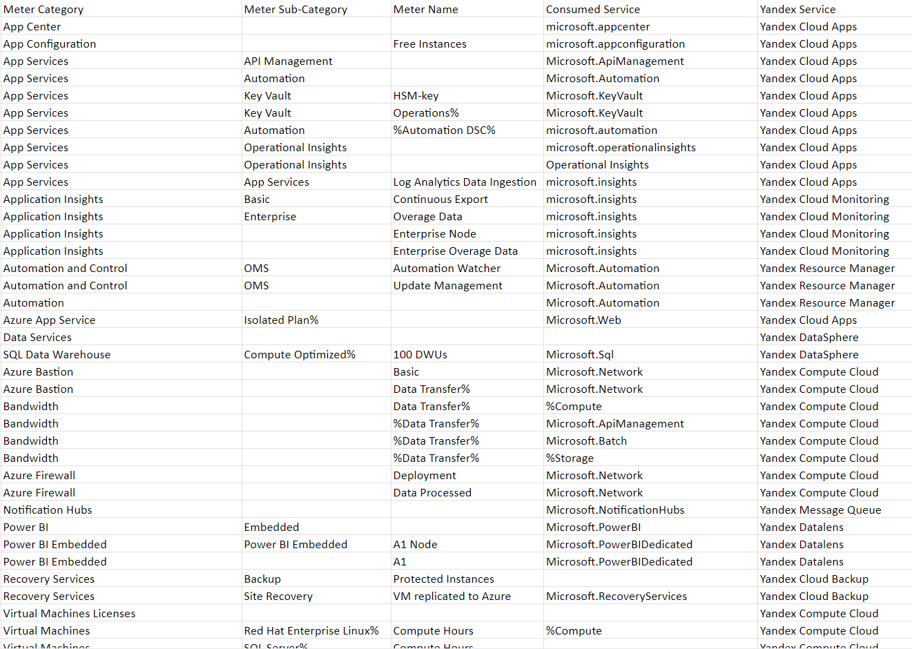

# Лабораторная работа №2 (Azure)

Вариант №6

## Цель работы

Знакомство с облачными сервисами. Понимание уровней абстракции над инфраструктурой в облаке. Формирование понимания типов потребления сервисов в сервисной-модели. Сопоставление сервисов между разными провайдерами. Оценка возможностей миграции на отечественные сервисы.

## Дано

 - Слепок данных биллинга от провайдера после небольшой обработки в виде SQL-параметров. Символ % в начале/конце означает, что перед/после него может стоять любой набор символов
 - Google с документациями провайдера

## Описание сервисов 

В таблице встречаются такие сервисы как:
 - Azure App Center,
 - Azure App Service,
 - Azure App Configuration,
 - Azure Application Insights,
 - Azure Power BI,
 - Azure Site Recovery,
 - Azure Virtual Machines,
 - Azure SQL Data Warehouse.
 - Azure Automation,
 - Azure Bastion,
 - Azure Firewall,
 - Azure Notification Hubs,

## Краткое описание с аналогами.

### Azure App Center
Платформа для упарвления и автоматизиции жизненного цикла приложений для iOS, Android, Windows и macOS.

Аналог: Yandex Cloud Apps - сервис от Yandex Cloud, который позволяет в один клик развернуть готовое cloud-native приложение из каталога.

### Azure App Service
Платформа для развертывания веб-приложений, мобильных бэкэндов и API. Предоставляет высокоуровневые службы для упрощения разработки, развертывания и масштабирования приложений.

Аналог: Yandex Cloud Apps - сервис от Yandex Cloud, который позволяет в один клик развернуть готовое cloud-native приложение из каталога.

### Azure App Configuration
Платформа предназначенная для упрощения управления и настройки приложений для разработчиков и ИТ-специалистов

Аналог: Yandex Cloud Apps - сервис от Yandex Cloud, который позволяет в один клик развернуть готовое cloud-native приложение из каталога.

### Azure Application Insights
Платформа для управления производительностью приложений, предназначенный в основном для веб-разработчиков.

Аналог: Yandex Cloud Monitoring -  сервис от Yandex Cloud, предназначенный для сбора, хранения и отображения метрик, а также настройки алертов и уведомлений по ним.

### Azure Power BI
Сервис для самостоятельной и корпоративной аналитики, которое позволяет визуализировать данные и обмениваться полезной информацией внутри организации.

Аналог: Yandex DataLens - это сервис визуализации и анализа данных от Yandex Cloud, предназначенный для создания диаграмм, таблиц и дашбордов на основе данных из различных источников.

### Azure Site Recovery
Сервис от Microsoft, предназначенный для обеспечения непрерывности бизнес-процессов и аварийного восстановления приложений и виртуальных машин в облачной платформе Microsoft Azure.

Аналог: Yandex Cloud Backup - это сервис от Yandex Cloud, предназначенный для создания резервных копий и восстановления виртуальных машин.

### Azure Virtual Machines
Представляют собой масштабируемые вычислительные ресурсы, которые можно арендовать по требованию в облачной платформе Microsoft Azure.

Аналог: Yandex Compute Cloud - это ключевой элемент облачной платформы Yandex Cloud, предоставляющий вычислительные мощности для запуска и масштабирования веб-проектов и приложений.

### Azure SQL Data Warehouse
Управляемое решение для хранилищ данных как услуги (DWaaS), предлагаемое Microsoft Azure.

Аналог: Yandex DataSphere - это облачный сервис для анализа данных, разработки и эксплуатации моделей машинного обучения (ML), являющийся частью платформы Yandex.Cloud.

### Azure Automation
Это облачная служба автоматизации, обновлений операционной системы и настройки, которая поддерживает согласованное управление в среде Azure и средах, отличных от Azure.

Аналог: Отсутствует, но может подойдети Yandex Cloud Functions - это serverless-решение от Yandex Cloud, позволяющее запускать код приложения в виде функции в безопасной, отказоустойчивой и автоматически масштабируемой среде.

### Azure Bastion
Полностью управляемая служба PaaS, которая обеспечивает безопасное подключение к виртуальным машинам через частный IP-адрес.

Аналог: Отсутствует, но может подойти Yandex Compute Cloud - это ключевой элемент облачной платформы Yandex Cloud, предоставляющий вычислительные мощности для запуска и масштабирования веб-проектов и приложений.

### Azure Firewall
Платформа для обеспечения облачной безопасности, которое защищает ресурсы Azure от внешних угроз.

Аналог: Отсутствует, но может подойти Yandex Compute Cloud - это ключевой элемент облачной платформы Yandex Cloud, предоставляющий вычислительные мощности для запуска и масштабирования веб-проектов и приложений.

### Azure Notification Hubs
Сервис, который помогает разработчику решать проблему управления Push-уведомлениями.

Аналог: Отсутствует, но может подойти Yandex Message Queue — это сервис для обмена сообщениями между приложениями в Yandex Cloud. Он позволяет разработчикам создавать системы, где одни приложения отправляют сообщения в очередь, а другие — забирают их оттуда для дальнейшей обработки.

## Сопоставление сервисов

Представим наши размышления в виде таблицы, где в первом столбце будут сервисы Azure, а во втором - сервисы Yandex Cloud, которые мы считаем аналогами.

| Azure | Yandex Cloud |
| ----- | ------------ |
| Azure App Center | Yandex Cloud Apps |
| Azure App Service | Yandex Cloud Apps |
| Azure App Configuration | Yandex Cloud Apps |
| Azure Application Insights | Yandex Cloud Monitoring |
| Azure Power BI | Yandex DataLens |
| Azure Site Recovery | Yandex Cloud Backup |
| Azure Virtual Machines | Yandex Compute Cloud |
| Azure SQL Data Warehouse | Yandex DataSphere |
| Azure Automation | нет аналога (частично может подойти Yandex Cloud Functions) |
| Azure Bastion | нет аналога (частично может подойти Yandex Compute Cloud) |
| Azure Firewall | нет аналога (частично может подойти Yandex Compute Cloud)  |
| Azure Notification Hubs | нет аналога (частично может подойти Yandex Message Queue) |

Результат [тут](./result.csv).

  

## Выводы

Мы изучили сервисы Azure и нашли почти для каждой российские аналоги. Для некоторых есть похожие сервисы, но не который функционал у них отсутствует. Из этого можно сделать вывод что переход на Российские аналоги можно сделать, но стоит учитывать не которые риски.