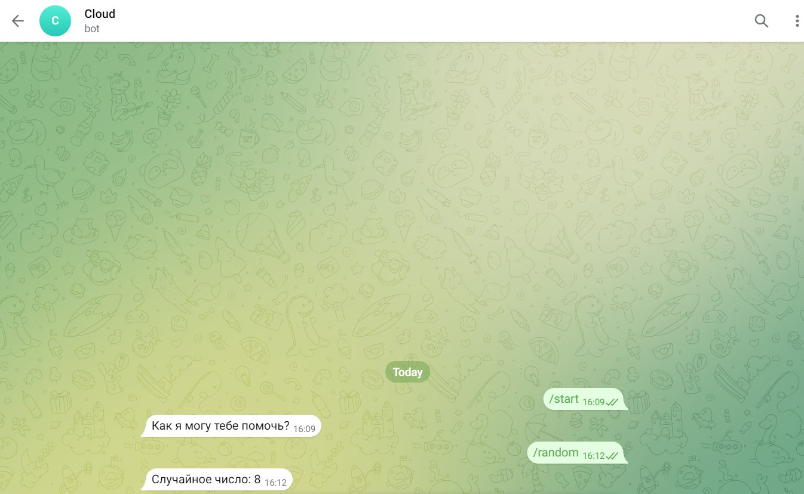

# Лабораторная работа 2

### Цель работы
Написать два Dockerfile – плохой и хороший. Описать все плохие практики из кода Dockerfile и почему они плохие, как они были исправлены в хорошем  Dockerfile, а также две плохие практики по использованию этого контейнера

### Telegram Bot

За основу в работе с Dockerfile был выбран Telegram bot.

## Создание
Telegram bot создан на Python.

### Создание и запуск

Используются для этого две команды:

**docker build -t bot .** : Создание обраpа и использование корневого каталога для контекста сборки. Модификатор -t задает тег для образа.

**docker run --name tgbot -e -d bot**: Эта команда запускает Docker-контейнер на основе образа по нашему тегу. 

## Анализ ошибок в сборке и как они были исправлены
### BAD DOCKERFILE

### GOOD DOCKERFILE

### 1.ADD > COPY

Необходимо использовать команды которые имеют меньше уязвимостей и имеют меньше функциональности, чтобы не стать потенциально опасными при создании Docker образа. ADD может распаковывать архивы из за чего имеет больший функционал, который стоит не использовать.

### 2. ENV TOKEN="%Token%" > ENV TOKEN="000"

Важную информацию не стоит показывать в DockerFile, это может быть опасно. Лучше ставить какую то заглушку и передавать значение во время запука контейнера через модификатор -e.

### 3.ENTRYPOINT python bot.py ---> ENTRYPOINT [ "python", "bot.py" ]**

Когда вы используете форму JSON-массива, Docker обрабатывает аргументы внутри контейнера так, как ожидается. Docker будет интерпретировать "python" как исполняемую команду, а "bot.py" как ее аргумент. Это важно для правильного выполнения команды внутри контейнера.

Формат JSON-массива также более совместим с различными оболочками и средами выполнения, что может быть важно при интеграции с другими инструментами и скриптами.

## Вывод

Мы научились создавать образы и запускать Docker контейнеры. Мы посмотрели наглядно какие удачные варианты написания Docker файла, а какие не удачные и удачные варинаты написания Docker образов и что требует внимания.
