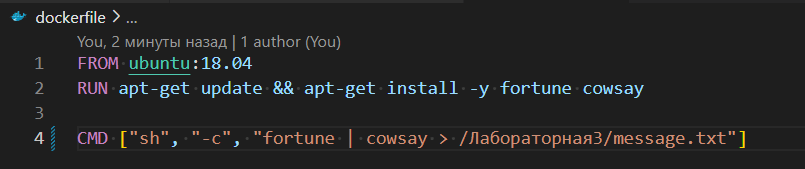

# Лабораторная работа 3

## Цель работы
Сделать, чтобы после пуша в ваш репозиторий автоматически собирался докер образ и результат его сборки сохранялся куда-нибудь.
(например, если результат - текстовый файлик, он должен автоматически сохраниться на локальную машину, в ваш репозиторий или на ваш сервер).

## Создание Dockerfile

Создадим Dockerfile и собирем из него образ. Для примера пусть она будет выводит предсказание.

Он находит в корневом каталоге репозитория.

## Создание GitHub Actions

Для автоматической сборки мы будем использовать GitHub Actions.

В нём мы говорим, что при пуше в main будет происходить сборка образа.

Он находит в .github/workflows/docker.yml.

<!-- ## Проверка

После пуша в репозиторий во вкладке Actions можно увидеть, что сборка прошла успешно.

Во вкладке Artifacts можно увидеть файлы, которые были сохранены.

 -->

## Выполнение сборки

Мы увидели что мы можем не использовать удаленный сервер, а использовать github Actions, который предоставляет нам бесплатный сервер для сборки образов.

### Выводы

В лабораторной работе мы научились работать с GitHub Actions и настроили автоматическую сборку и сохранение его в файл.